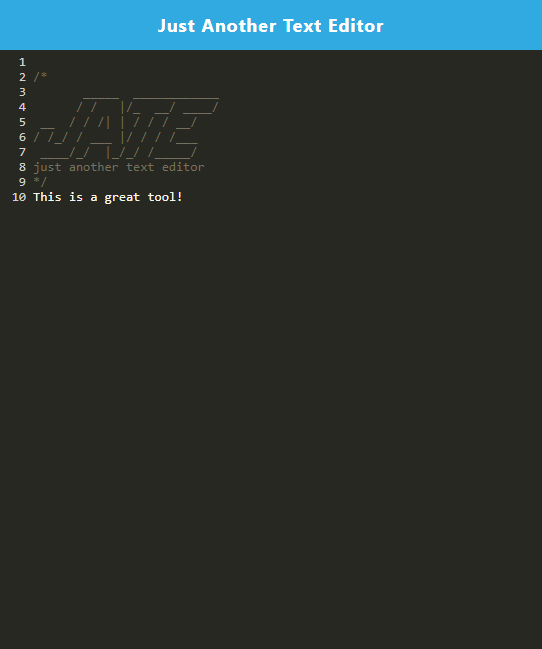

# text-editor-pwa-app

## Description 
The Just Another Text Editor (JATE for short) is a progressive web application and the method for creating this application was to have something fully function while online but also to have the ability to retain properties of the application if your internet dropped or you were offline for a period of time. This gives a solution to the problem of losing internet for a brief period of time. There is the ability to retain content and upon reload the content is still there. Progressive Web Application is a great tool to have in various applications. I grew in my ability  to interact with webpack configurations and using babel in next-gen javascript.

## Installation
Upon loading the application you will see an install button, click on that and it will open up a modal that will ask you to install the text editor. This will install it on your desktop. Then you will see the blinking cursor after the JATE, feel free to type in any text it will be there. You can open up the inspect tools, check out the application tab and see the manifest and the service worker. 

## Usage
The link for the application is here: https://lit-cliffs-63394.herokuapp.com/

